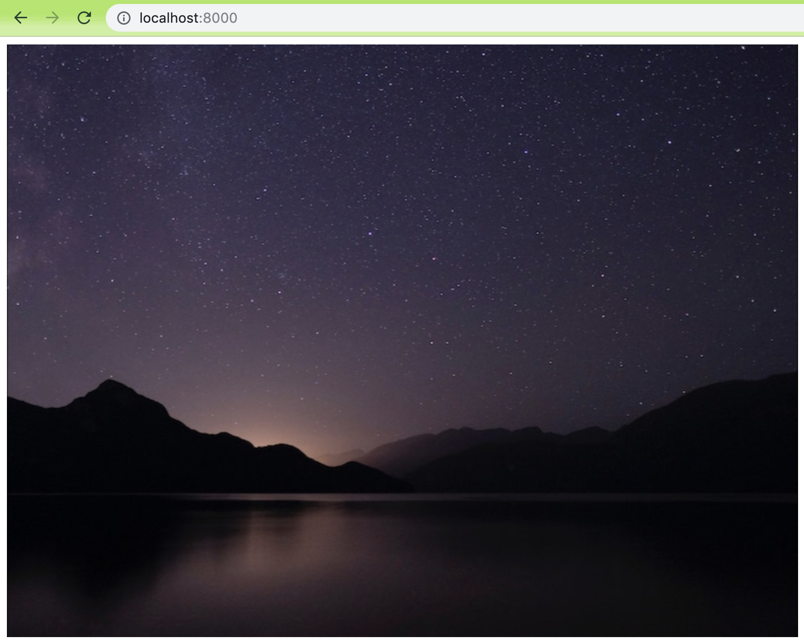
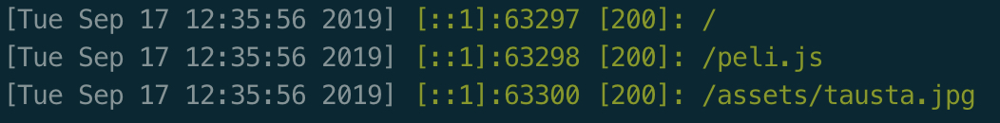

# Javascriptiä, osa 1

Aikaisemmin laitoimme `index.html`-tiedoston lataamaan pelikoodin tiedostosta `peli.js`. Nyt on aika luoda tuo tiedosto ja alustaa sinne Phaserin perusteita.

## Phaserin perusasetukset

Määritellään ensiksi Phaserin perusasetuksia.

```
var config = {
	type: Phaser.AUTO,
	width: 800,
	height: 600,
	scene: {
		preload: preload,
		create: create
	}
};
```

Tässä luodaan objekti, johon määritellään muutamia Phaserin perusasetuksia:

- `type` on käytettävä renderöijä, asetuksella `Phaser.AUTO` käytössä on WebGL mikäli mahdollista, mutta muuten Canvas.
- `width` ja `height` säätävät pelin kooksi 800 &times; 600 pikseliä.
- `scene` määrittelee "kohtauksen", josta peli alkaa. Kohtauksen määrittelee joukko funktioita, joista tässä otetaan käyttöön kaksi, ennen latausta suoritettava `preload` ja kerran ajettava `create`. Tavallisesti mukana on myös jatkuvasti ajettava `update`, mutta sitä ei vielä tarvita. Näihin funktioihin perehdytään seuraavaksi.

Kun asetukset on näin määritelty, peli luodaan näin:

	var game = new Phaser.Game(config);

Nyt muuttujassa `game` on uusi Phaser-peli, joka on luotu yllä mainituilla asetuksilla. Tällaisenaan koodi ei vielä toimi, vaan meidän pitää ensin määritellä funktiot `preload()` ja `create()`.

## Taustakuva pelille

Aloitetaan luomalla kohtaus, joka piirtää ruudulle taustakuvan. Etsi jostain mieluisa taustakuva. Kuvan pitäisi olla kooltaan 800 &times; 600 pikseliä, mutta ei haittaa, jos kuva on suurempi. Kannattaa kuitenkin katsoa, että mittasuhteet ovat samat 4:3. Sopivia kuvaformaatteja ovat `jpg` ja `png`.

### Sopivan kuvan löytäminen ja tallentaminen

Näyttäviä kuvia löytää vaikkapa [Unsplashista](https://unsplash.com/) tai [Pexelsistä](https://www.pexels.com/). Itse nappasin Unsplashista heti päivän kuvana olleen [Murphy Zhengcin tähtitaivaan](https://unsplash.com/photos/wf_T3ZuuB4U). Kuva on vähän turhan iso ja vähän väärässä kuvasuhteessa, joten kutistin ja rajasin sen kokoon 800 &times; 600 pikseliä ja tallensin nimellä `tausta.jpg`.

Pelin tarvitsemat tiedostot kannattaa järjestellä fiksusti. Sijoitin itse kuvan hakemistoon `peliprojekti` alihakemistoon `assets` – pelin materiaaleja kutsutaan asseteiksi, siitä nimi. Laita siis sinäkin taustakuvasi siten, että se löytyy paikasta `peliprojekti/assets/tausta.jpg`.

### Kuvan lataus – preload()

Nyt voimme ladata kuvatiedoston peliin `preload()`-funktiossa näin:

```
function preload() {
	this.load.image("tausta", "assets/tausta.jpg")
}
```

`this.load.image()` lataa määritellystä polusta kuvan ja luo siitä käytettävän kuvaobjektin annetulla nimellä. Nyt siis kuva nimeltä `tausta` viittaa projektiin tallennettuun kuvatiedostoon.

### Kuvan näyttäminen – create()

Tämä ei vielä saa kuvatiedostoa näkymään pelissä, vaan siihen käytetään `create()`-funktiota:

```
function create() {
	this.add.image(400, 300, "tausta")
}
```

Tämä lisää kuvan `tausta` koordinaatteihin `400, 300`. Kyse on kuvan keskipisteen koordinaateista, siksi koordinaateiksi annetaan 800 &times; 600 -kokoisen pelialueen keskipiste, eikä esimerkiksi luontevamman tuntuinen `0, 0`.

## Taustakuva näkyy!

Nyt kun peliohjelmamme on kokonaisuudessaan tällainen, kuvan pitäisi näkyä:

```
var config = {
	type: Phaser.AUTO,
	width: 800,
	height: 600,
	scene: {
		preload: preload,
		create: create
	}
}

var game = new Phaser.Game(config)

function preload() {
	this.load.image("tausta", "assets/tausta.jpg")
}

function create() {
	this.add.image(400, 300, "tausta")
}
```

Jos kaikki on kohdallaan, osoitteesta `http://localhost:8000` pitäisi löytyä jotain tämännäköistä:



ja jos katsotaan webbipalvelimen tulostusta, huomaamme, että sivu on ladattu, sivunlatauksesta on seurannut `peli.js`-tiedoston lataus ja sen jälkeen kuvan lataus:



Kaikki toimii tähän asti niinkuin pitää!