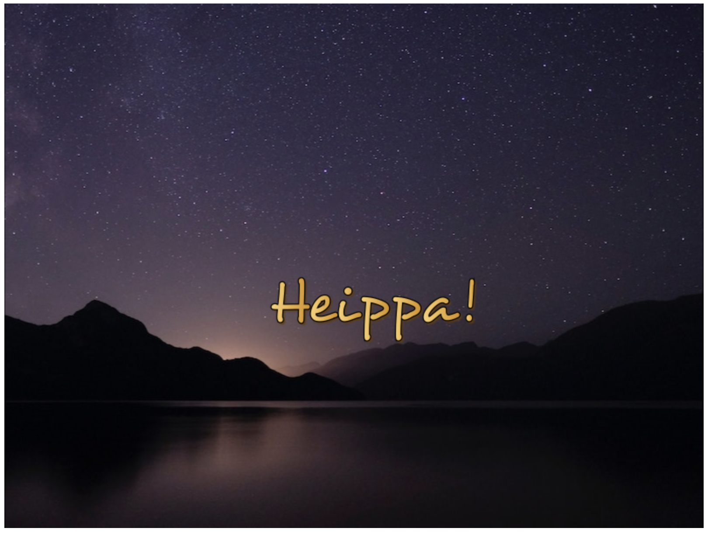
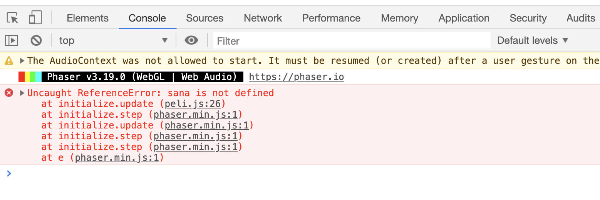

# Alussa oli sana

Kokeillaanpa sitten saada ruudulle näkyviin sana. Pelkkä perusteksti on vähän tylsää, joten haluamme tekstistä vähän näyttävämmän näköistä. Käytämme siksi bittikarttafonttia.

Emme tässä mene nyt tämän asian yksityiskohtiin sen syvemmin, kunhan nappaamme käyttöömme valmiin Desyrel-bittikarttafontin [Phaserin esimerkkiaineistoista](https://github.com/photonstorm/phaser3-examples/tree/master/public/assets/fonts/bitmap).

## Bittikarttafontin lataaminen ja käyttäminen

Bittikarttafontti ladataan `preload()`-funktiossa näin:

	this.load.bitmapFont('desyrel', 'assets/desyrel.png', 'assets/desyrel.xml');

Tämä edellyttää, että `assets`-hakemistosta löytyy `desyrel.png`, jossa on kaikki fontin merkit ja `desyrel.xml`, joka kertoo, missä kohtaa kuvaa mikäkin merkki on. Hae siis nämä tiedostot Phaserin esimerkkiaineistoista ja sijoita ne `assets`-hakemistoon.

Kun haluamme kirjoittaa fontilla tekstiä näytölle, sen voi tehdä vaikkapa `create()`-funktiossa:

```
var sana = this.add.bitmapText(300, 300, "desyrel", "")
sana.text = "Heippa!"
```

Ensimmäisellä rivillä luomme bittikarttatekstin koordinaatteihin `300, 300`, käyttäen ladattua `desyrel`-fonttia, mutta mitään tekstiä ei vielä lisätä (`""`). Seuraavalla rivillä sanaan lisätään sitten tekstiä.

Koko koodi näyttää nyt tältä:

```
var config = {
	type: Phaser.AUTO,
	width: 800,
	height: 600,
	scene: {
		preload: preload,
		create: create
	}
}

var game = new Phaser.Game(config)

function preload() {
	this.load.image("tausta", "assets/tausta.jpg")
	this.load.bitmapFont("desyrel", "assets/desyrel.png", "assets/desyrel.xml")
}

function create() {
	this.add.image(400, 300, "tausta")
	var sana = this.add.bitmapText(300, 300, "desyrel", "")
	sana.text = "Heippa!"
}
```

ja lopputuloksen pitäisi olla tämän näköistä:



## Putoavaa tekstiä

Pelin tarkoituksena oli, että teksti putoaa alas ruudulla. Kokeillaanpa, miten teksti saataisiin liikkumaan. Luodaan se ruudun yläreunaan ja laitetaan se liikkumaan.

Liikkumisen toteuttaminen vaatii `update()`-kutsun lisäämistä pelin asetuksiin:

```
var config = {
	type: Phaser.AUTO,
	width: 800,
	height: 600,
	scene: {
		preload: preload,
		create: create,
		update: update
	}
}
```

Päivitysfunktio `update()` ajetaan uudestaan ja uudestaan niin kauan kuin peli on päällä. Muutetaan `create()`-funktiota niin, että sana luodaan ruudun yläreunaan ja luodaan `update()`-funktio, joka liikuttaa sanaa alaspäin. Kun joku esine on luotu Phaseriin, sen liikuttaminen on helppoa: esineet ovat objekteja, joilla on muun muassa attribuutit `x` ja `y`, jotka kertovat esineen sijainnin kohtauksessa. Niinpä pudottaminen tapahtuu helposti lisäämällä `y`-arvoa yhdellä joka päivityksellä:

```
function create() {
	this.add.image(400, 300, "tausta")
	var sana = this.add.bitmapText(300, 0, "desyrel", "")
	sana.text = "Heippa!"
}

function update() {
	sana.y += 1
}
```

Mutta tämäpä ei toimikaan! Ruutu jää pimeäksi. Ongelma voisi olla mysteeri, mutta selaimen Javascript-konsoliin tulee virheilmoitus. Konsoli kannattaakin aina pitää näkyvillä koko ajan kun työskentelee koodin parissa. Nyt koodissa on tällainen virheilmoitus:



## Putoavaa tekstiä, uusi yritys

Vika on siinä, että `sana`-muuttuja on määritelty `create()`-funktion sisällä, joten `update()`-funktio ei siitä tiedä. Phaserissa kaikki muuttujat, joita haluaa käyttää eri funktioissa, on määriteltävä funktioiden ulkopuolella. Korjataan koodi siis ojennukseen.

```
var config = {
	type: Phaser.AUTO,
	width: 800,
	height: 600,
	scene: {
		preload: preload,
		create: create,
		update: update
	}
}

var game = new Phaser.Game(config)

var sana = null

function preload() {
	this.load.image("tausta", "assets/tausta.jpg")
	this.load.bitmapFont("desyrel", "assets/desyrel.png", "assets/desyrel.xml")
}

function create() {
	this.add.image(400, 300, "tausta")
	sana = this.add.bitmapText(300, 0, "desyrel", "")
	sana.text = "Heippa!"
}

function update() {
	sana.y += 1
}
```

Nyt kaikki toimii ja sana putoaa siististi alaspäin.

