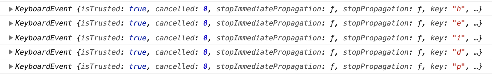

# Syötteiden lukemista

Seuraavaksi voisimme perehtyä syötteiden lukemiseen. Miten saadaan luettua näppäimistöltä pelaajan kirjoittama teksti?

## Tapahtumankäsittelijän rekisteröiminen

Jos halutaan lukea mitä tahansa näppäimenpainalluksia, meidän on rekisteröitävä tapahtumankäsittelijä näppäimistölle. Se tapahtuu `create()`-funktiossa näin:

	this.input.keyboard.on("keydown", keyPress)

Tämä ohjaa kaikki näppäimenpainallukset (`keydown`) käsittelijäfunktiolle `keyPress()`. Se meidän täytyy määritellä itse. Hyvä ensimmäinen vaihe on luoda tapahtumankäsittelijä, joka näyttää tapahtumat konsolissa, jotta näemme, millaista dataa tapahtumankäsittelijälle tulee.

```
function keyPress(event) {
	console.log(event)
}
```

Nyt kun käynnistämme pelin ja kirjoitamme jotain tekstiä, konsoli näyttää tältä:



Tästä näemme, että haluamamme yksityiskohta eli se, mitä näppäintä on painettu, löytyy `event`-objektin attribuutista `key`. Nyt voimme lähteä kehittelemään pelin tarvitsemaa toiminnallisuutta, eli mahdollisuuksia kirjoittaa sanoja. Koska muuttujaa kutsutaan erikseen jokaisella näppäimenpainalluksella, meidän on tallennettava kertyvä sana johonkin funktion ulkopuoliseen muuttujaan.

## Muut kuin kirjaimet

Kuinka tapahtumankäsittelijä reagoi muihin kuin kirjaimiin? Kokeilemalla selviää, että esimerkiksi Esc-napin painallus näkyy koodilla `Escape`, shiftistä tulee `Shift` ja niin edelleen. Tästä voi olla hyötyä jatkossa, mutta toistaiseksi emme halua välittää näistä. Yksinkertainen ratkaisu on ohittaa kaikki tapaukset, joissa `event.key` on pidempi kuin yhden merkin mittainen:

	if (event.key.length === 1) kirjoitus += event.key

## Sanan tuhoaminen

Tavoitteena oli siis saada tuhottua sana ruudulta kirjoittamalla se. Verrataan siis ruudulla putoavaa sanaa kirjoitettuun tekstiin ja jos ne vastaavat toisiaan, tuhotaan sana. Tuhoamiseen voidaan tässä käyttää Phaserin kaikilla peliobjektilla olevaa `destroy()`-metodia.

Tämän hetkinen koko pelikoodi näyttää tältä:

	var config = {
		type: Phaser.AUTO,
		width: 800,
		height: 600,
		scene: {
			preload: preload,
			create: create,
			update: update
		}
	}

	var game = new Phaser.Game(config)

	var sana = null
	var kirjoitus = ""

	function preload() {
		this.load.image("tausta", "assets/tausta.jpg")
		this.load.bitmapFont("desyrel", "assets/desyrel.png", "assets/desyrel.xml")
	}

	function create() {
		this.add.image(400, 300, "tausta")
		sana = this.add.bitmapText(300, 0, "desyrel", "")
		sana.text = "heippa"

		this.input.keyboard.on("keydown", keyPress)
	}

	function update() {
		sana.y += 1
	}

	function keyPress(event) {
		if (event.key.length === 1) kirjoitus += event.key
		if (kirjoitus === sana.text) {
			sana.destroy()
		}
		console.log(kirjoitus)
	}

Tämä toimii! Sanan saa tuhottua kirjoittamalla `heippa`.

## Helpotetaan hieman

Koodissa on tällaisenaan kuitenkin vielä ongelmia. Teksti pitää kirjoittaa täsmälleen oikein eikä tehtyä kirjoitusvirhettä ole mahdollista korjata. Tähän asiaan on muutamia lähestymistapoja, joista voimme valita. Päätämme, että emme halua antaa pelaajille mahdollisuutta korjata tekstiä, vaan se pitää kirjoittaa oikein. Sen verran voidaan kuitenkin helpottaa, että isoista ja pienistä kirjaimista ei tarvitse välittää.

Sen sijaan, että vertailemme koko kirjoitettua sanaa, vertaillaan vain kirjoitetun sanan loppuosaa. Siihen on Javascriptissä valmis [`endsWith()`-funktio](https://developer.mozilla.org/en-US/docs/Web/JavaScript/Reference/Global_Objects/String/endsWith):

	if (event.key.length === 1) kirjoitus += event.key.toLowerCase()
	if (kirjoitus.endsWith(sana.text)) {
		sana.destroy()
	}

Nyt peli toimii kuten pitää: sanan `heippa` saa tuhottua kun kirjoittaa `heippa`, vaikka ennen sitä olisi kirjoittanut mitä. Isot ja pienet kirjaimet hoidetaan muuttamalla kaikki syötetyt kirjaimet pieniksi [`.toLowerCase()`-funktiolla](https://developer.mozilla.org/en-US/docs/Web/JavaScript/Reference/Global_Objects/String/toLowerCase).